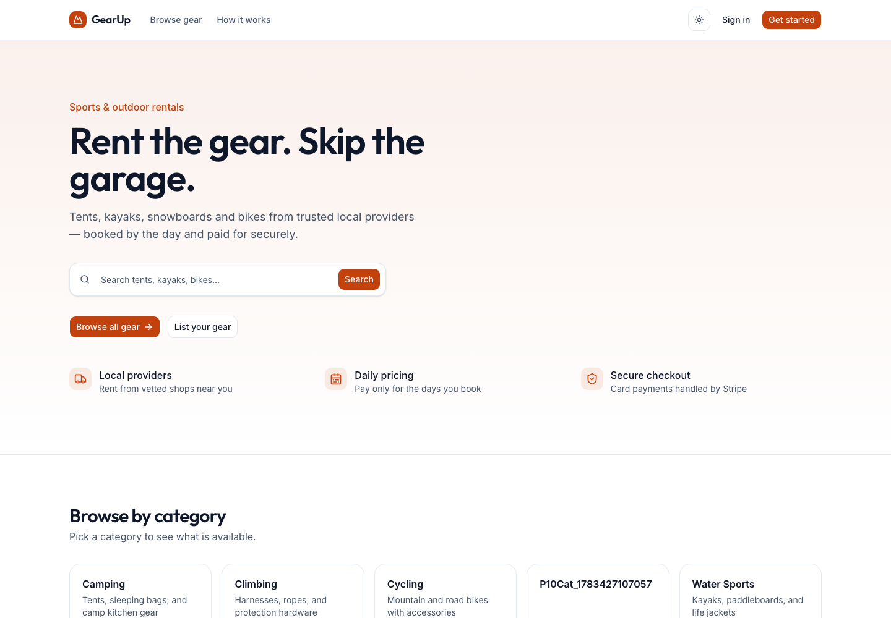
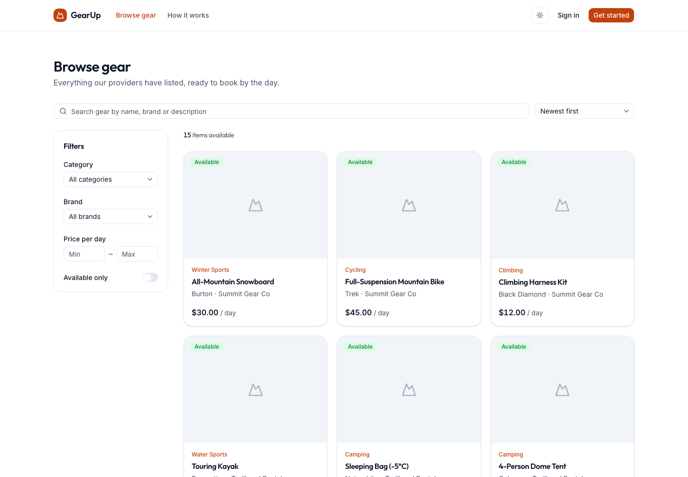
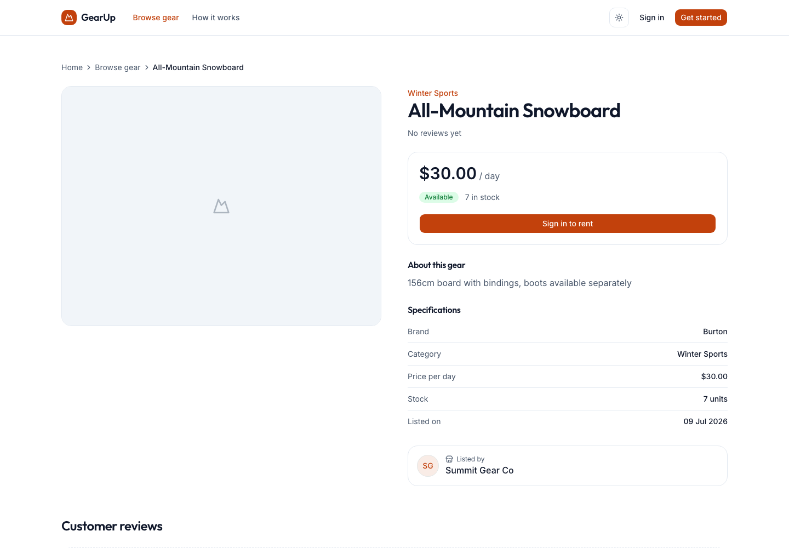

# GearUp — Sports & Outdoor Gear Rental

A full-stack gear rental marketplace. Customers browse equipment, book it by the
day and pay by card; providers list their gear and move bookings through the
rental lifecycle; admins moderate the platform.

This repository is the **frontend** (Next.js). It talks to the GearUp REST API
over HTTPS — see [`API_INTEGRATION.md`](./API_INTEGRATION.md) for the endpoint map.

| | |
|---|---|
| **Live frontend** | _add the Vercel URL here after deploying_ |
| **Live API** | https://ph-b7-assignemnt-4.vercel.app/api/v1 |
| **API health** | https://ph-b7-assignemnt-4.vercel.app/api/v1/health |



---

## Demo accounts

| Role | Email | Password |
|---|---|---|
| **Admin** | `admin@gearup.com` | `Admin@1234` |
| Provider | `summit.gear@gearup.com` | `Password@123` |
| Provider | `trailhead.rentals@gearup.com` | `Password@123` |
| Customer | register your own, or use any seeded customer | `Password@123` |

Admins exist only through the database seed — the register form offers
**Customer** and **Provider** only, matching the API.

---

## Stack

| Area | Choice |
|---|---|
| Framework | Next.js 16 (App Router, Server Components, Turbopack) |
| Language | TypeScript 5, strict |
| UI | Tailwind CSS v4 + shadcn/ui (Radix) |
| Data | Server Components for reads, TanStack Query v5 for mutations |
| Forms | React Hook Form + Zod 4 (`src/schemas/`) |
| Payments | Stripe Elements (`@stripe/react-stripe-js`) |
| Dates | date-fns |
| Toasts | Sonner |
| Theme | next-themes (light/dark, system default) |

**Design system:** "Trail Amber" — burnt orange primary, slate neutrals, six
semantic tone pairs (`--tone-pending|info|progress|success|neutral|danger`) that
every status badge draws from. Fonts are Inter (body) and Outfit (display).

---

## Getting started

Requirements: **Node 20+** (developed on Node 23) and **pnpm 9+**.

```bash
pnpm install
cp .env.example .env.local     # then fill in the values below
pnpm dev                       # http://localhost:3000
```

Other scripts:

```bash
pnpm build     # production build
pnpm start     # serve the production build
pnpm lint      # eslint (next/core-web-vitals + react-compiler rules)
npx tsc --noEmit
```

### Environment variables

| Variable | Scope | Required | Value |
|---|---|---|---|
| `API_BASE_URL` | server only | yes | `https://ph-b7-assignemnt-4.vercel.app/api/v1` |
| `AUTH_COOKIE_NAME` | server only | no | defaults to `gearup_token` |
| `NEXT_PUBLIC_STRIPE_PUBLISHABLE_KEY` | browser | for payments | `pk_test_…` from **the same Stripe account as the API's secret key** |
| `NEXT_PUBLIC_APP_URL` | browser | yes in production | the deployed origin, e.g. `https://gearup.vercel.app` — used for `metadataBase`, OG tags, `robots.txt` and `sitemap.xml` |

`API_BASE_URL` is deliberately **not** `NEXT_PUBLIC_` — the browser never calls
the API directly.

> Without a real publishable key the pay page renders an explicit "Card payments
> are not configured" notice instead of a broken card form.

---

## Architecture

```
src/
├── app/
│   ├── (public)/          landing, gear browse, gear detail
│   ├── (auth)/            login, register
│   ├── dashboard/         customer · provider · admin areas + shared profile
│   ├── payment/           success (polls) · cancel
│   └── api/               BFF route handlers (server-only)
├── components/            ui/ layout/ gear/ rental/ payment/ review/ dashboard/ admin/
├── lib/                   api, client-api, session, orders, provider, admin, reviews, stripe, utils
├── schemas/               zod: auth, gear, rental, review, profile, category
├── constants/             nav, routes, status maps
└── middleware.ts          route protection by role
```

**Auth.** Login goes to a Next route handler, which stores the API's JWT in an
**httpOnly, sameSite=lax cookie**. The token never reaches JavaScript. Client
components reach the API through `/api/backend/*`, which re-signs each request
from that cookie. `middleware.ts` decodes the JWT payload (without verifying it —
the API stays the authority) purely to decide routing: signed-out users hitting a
dashboard go to `/login?next=…`, signed-in users hitting `/login` go to their role
home, and each role is confined to its own area.

**Data.** Reads happen in Server Components so pages are server-rendered and
shareable; every list keeps its filters in the URL. Mutations use TanStack Query
and then `router.refresh()` so the server-rendered view picks up the change.

---

## Features

**Public** — landing page with category tiles and featured gear; gear browse with
search, category, brand, price-range and availability filters, sorting and
pagination (all URL state); gear detail with an image gallery, specs, provider
card, reviews with a rating breakdown, and related gear.

**Customer** — booking panel with a range date picker, quantity stepper and a live
total; orders list with status filters; order detail with an item breakdown, a
lifecycle timeline and per-status actions; cancel with confirmation; Stripe
Elements checkout; a success page that polls until the webhook confirms; payment
history and receipts; reviews on returned rentals.

**Provider** — overview with listings, pending orders, active rentals and
earnings; gear table with an availability switch, edit and delete; add/edit form
with a multi-image URL input and live previews; incoming orders with the legal
status transitions (Confirm → Mark picked up → Mark returned).

**Admin** — platform KPIs (users, providers, suspended, gear, rentals, revenue);
user management with role/status filters, search, pagination and suspend/activate;
all-gear and all-rentals moderation tables; category CRUD.

**Throughout** — light/dark theme, responsive down to 360px (tables become cards),
skeletons on every async route, error boundaries with retry, custom 404s, offline
toast, and **Lighthouse accessibility 100** on the public pages.




---

## Deploying to Vercel

1. Push this directory to GitHub.
2. In Vercel, **New Project → import the repo**. If the repo root is the monorepo
   rather than this folder, set **Root Directory** to `gear-up-frontend`.
   Framework preset: **Next.js**.
3. Add the environment variables above under **Settings → Environment Variables**
   for *Production*, *Preview* and *Development*:
   - `API_BASE_URL`
   - `AUTH_COOKIE_NAME` (optional)
   - `NEXT_PUBLIC_STRIPE_PUBLISHABLE_KEY`
   - `NEXT_PUBLIC_APP_URL` — set this to the final deployment URL, then
     **redeploy** so OG tags, `robots.txt` and `sitemap.xml` use it.
4. Deploy, then smoke-test on the live URL: sign in as each role, browse and
   filter gear, place a rental, confirm it as the provider, and pay with Stripe
   test card `4242 4242 4242 4242` (any future expiry, any CVC).

**For payments to complete end to end**, the API's Stripe account needs a webhook
endpoint pointing at `POST https://<api-host>/api/v1/payments/confirm` subscribed
to `payment_intent.succeeded` and `payment_intent.payment_failed`. Card
confirmation happens in the browser, but only that webhook sets the order to
`PAID` — which is why the success page polls rather than declaring success.
